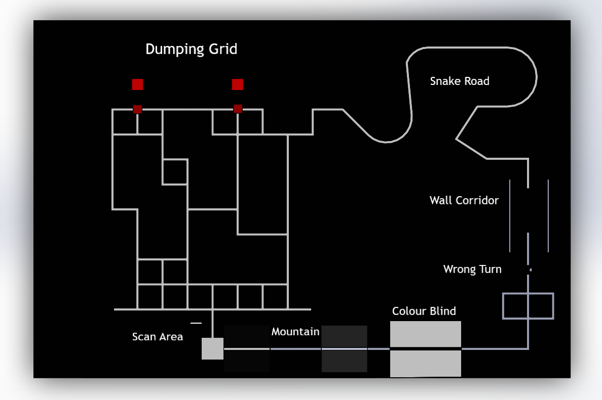

# SRA Autosim Challenge (SAC) 2020

## Theme:



The world continues to move deliberately towards a transportation system driven by autonomous vehicles having benefits like lesser travel time, cheaper transportation costs, reduced CO2 emissions, and many more. But with great power comes great responsibility. Designing a safer mechanism while maintaining an efficient program has always been a top priority. 
A line following vehicle is in a way an entry level autonomous vehicle that can navigate any course while following on a contrasting background. As a line follower bot always needs a path to run, its applications are limited. This is where various sensors like lidar, ultrasonic, camera come into picture. 

### [Statement](https://drive.google.com/file/d/1-HUtt-bm3C8wKsXfCvsx6lSd64l9kTW4/view?usp=sharing)  
### 

## Steps To Follow:

```
git clone https://github.com/SRA-VJTI/SRA_Autosim_Challenge_v1.0.git
```

* Add marker10 and sampleQR to models in `.gazebo`  

* Make the following changes in world and launch files in arena_with_qr package  

  1. Change path in line `105` and `127` in `sample_arena.world`

   ```
   <uri>/home/neha_kurian/catkin_ws/src/sample_arena_urdf/meshes/arena_samplenew.dae</uri>
   ```
   
  2. Change path in line `293` and `315` in `final_arena.world`

   ```
   <uri>/home/neha_kurian/catkin_ws/src/final_arena_urdf/meshes/final_arena.dae</uri>
   ```

  3. Change path in line `7` of `sample_arena.launch`  
   
   ```
   <arg name="world" default="/home/neha_kurian/catkin_ws/src/arena_with_qr/world/sample_arena.world" />
   ```

  4. Change path in line `7` of `final_arena.launch `
   
   ```
   <arg name="world" default="/home/neha_kurian/catkin_ws/src/arena_with_qr/world/final_arena.world" />
   ```
   
   
* Open terminal from your workspace and do
   
   ```
   catkin_make
   source devel/setup.bash
   ```
   
* To launch sample arena:  
   
   ```  
   roslaunch arena_with_qr sample_arena.launch
   ```
   
* To launch final arena:
   
   ```
   roslaunch arena_with_qr final_arena.launch
   ```
